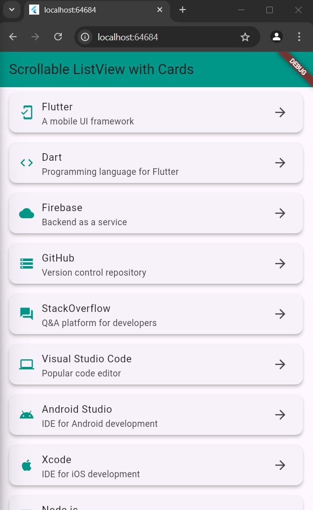

# Scrollable ListView with Cards

This Flutter application displays a scrollable list of items using the `ListView` widget. Each item is customized using the `Card` and `ListTile` widgets, providing a visually appealing layout for presenting data.

## Features

- A scrollable list view displaying a list of items.
- Each list item is represented as a card with a leading icon, title, subtitle, and trailing icon.
- A clean and modern UI.

## Project Structure

```
lib/
├── models/
│   └── list_item_data.dart         // Contains ListItemData class
├── data/
│   └── list_data.dart              // Contains List Items data
├── widgets/
│   └── list_item.dart              // Contains the UI widget for displaying items
├── screens/
│   └── list_view.dart              // Contains the ListView screen
├── main.dart                       // Entry point of the application
assets/
├── screenshots/                    // Screenshot of the application
│   └── image01.png   
│   └── image02.png              
```

## Installation

1. Clone this repository:
   ```bash
   git clone https://github.com/jtareen/lab4_task3.git
   ```
   
2. Navigate to the project directory:
   ```bash
   cd lab4_task3
   ```

3. Install the dependencies:
   ```bash
   flutter pub get
   ```

4. Run the application:
   ```bash
   flutter run
   ```

## Screenshot



## Contributing

If you would like to contribute to this project, please open an issue or submit a pull request.

## License

This project is licensed under the MIT License. See the [LICENSE](LICENSE) file for details.